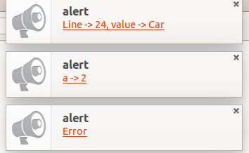

# Notification Logger

Ever wondered why you have to open the console every time you want to want to log a variable?

Notification Logger helps provide desktop notification for your console messages.

During development, You have to check the browser's inspector periodically to see what your console.log()'s are saying.

With [notification-logger](https://hkirat.github.io/notification-logger/), you can develop and debug web apps and see console messages as Desktop Notifications.

And it only adds ~100 lines to your project.

[Demo](https://hkirat.github.io/notification-logger/)

## Screenshot

## Installing
 - Download the project
 - include notification-logger.js
 - Initialise with logger.init()

## Methods
-----
* `logger.init` - Initialises the logger
* `logger.log` - Logs the message via a Desktop Notification
* `console.log` - Logs the message via a Desktop Notification
* `logger.destroy` - Reverts console.log to original functionality

## Browser Support

Works best on latest versions of Google Chrome, Firefox and Safari.

